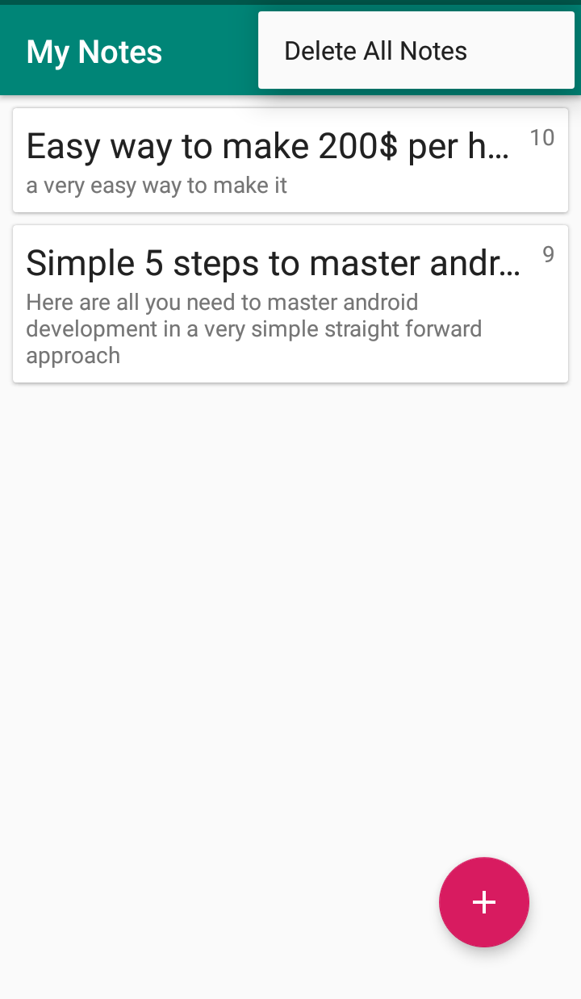

# Android Notes Application

> Android Notes application built using Room, Live Data and View Model architecture components.

> where you can create notes with specific priorites, read, update and swipe to delete specific note or delete all notes at once.

## Preview

